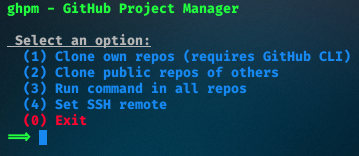

<div align = "center">

<h1><a href="https://2kabhishek.github.io/ghpm">ghpm</a></h1>

<a href="https://github.com/2KAbhishek/ghpm/blob/main/LICENSE">
 </a>

<a href="https://github.com/2KAbhishek/ghpm/graphs/contributors">
 </a>

<a href="https://github.com/2KAbhishek/ghpm/stargazers">
</a>

<a href="https://github.com/2KAbhishek/ghpm/network/members">
 </a>

<a href="https://github.com/2KAbhishek/ghpm/watchers">
 </a>

<a href="https://github.com/2KAbhishek/ghpm/pulse">
 </a>

<h3>The GitHub Project Manager 🧑‍💻⚙️</h3>

<figure>
  
  <br/>
  <figcaption>ghpm screenshot</figcaption>
</figure>

</div>

## What is this

ghpm is a utility that allows you to manage all your GitHub projects by allowing batch operations.

You can clone all of your or any other user's repos at once.

You can use it to push, pull and do any other operation on all your projects at once.

## Inspiration

I have a lot of repos on my GitHub and maintaining them was becoming a pain, also this makes moving my work to a new machine really smooth.

## Prerequisites

Before you begin, ensure you have met the following requirements:

- You have installed the latest version of `bash`
- Cloning self repos needs authentication and relies on `gh`, the GitHub cli

## Getting ghpm

To install ghpm, follow these steps:

```bash
git clone https://github.com/2kabhishek/ghpm.git
cd ghpm
# Setup symlink make sure target directory is added to PATH
ln -sfnv $PWD/ghpm.sh ~/.local//bin/ghpm
```

## Using ghpm

After symlinking, you can run `ghpm` in your GitHub repos parent directory, or you can pass it in as an argument

```bash
ghpm
# or
ghpm ~/Projects/GitHub
```

This will open up the self guided menu with a list of operations you can perform.

> You can use option 3 to run any command in all your GitHub repos, very useful for push, pull and similar commands.

## How it was built

ghpm was built using `bash`

## Challenges faced

Figuring out the GitHub api and authentication was a challenge, I used `gh` to do some heavy lifting.

## What I learned

- Best practices for `bash` scripts
- Bash functions and how it handles variables
- Used `awk`, `find`, `xargs` and other useful tools.

Hit the ⭐ button if you found this useful.

## More Info

<div align="center">

<a href="https://github.com/2KAbhishek/ghpm">Source</a> | <a href="https://2kabhishek.github.io/ghpm">Website</a>

</div>
